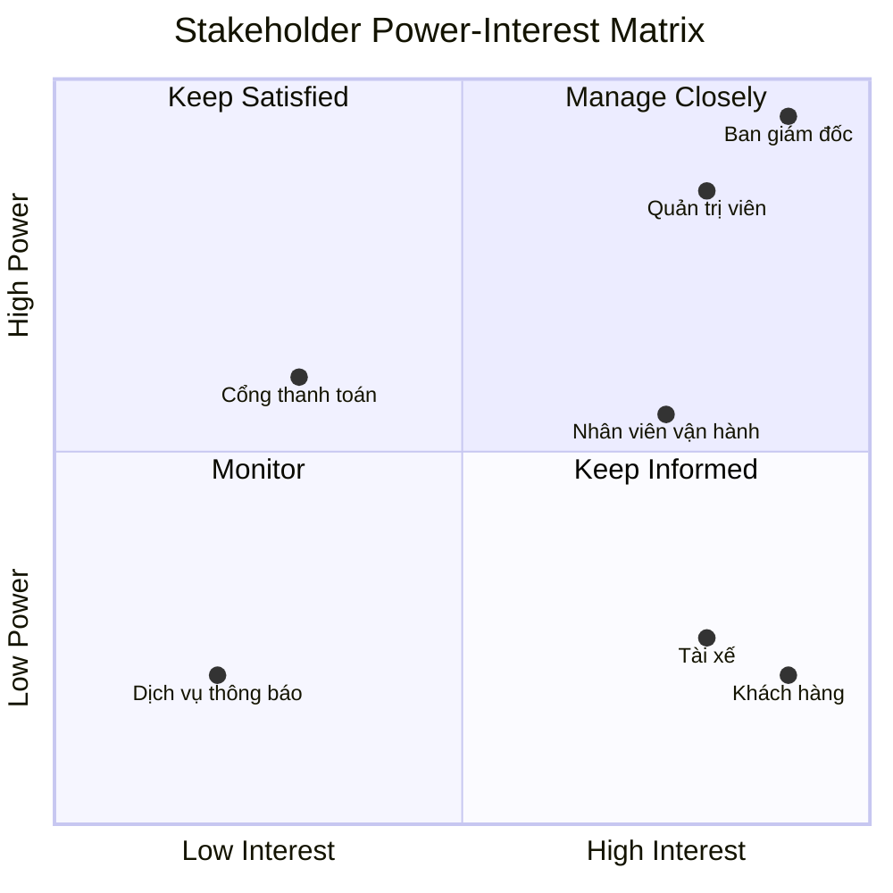
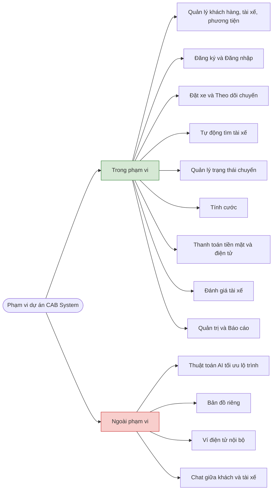
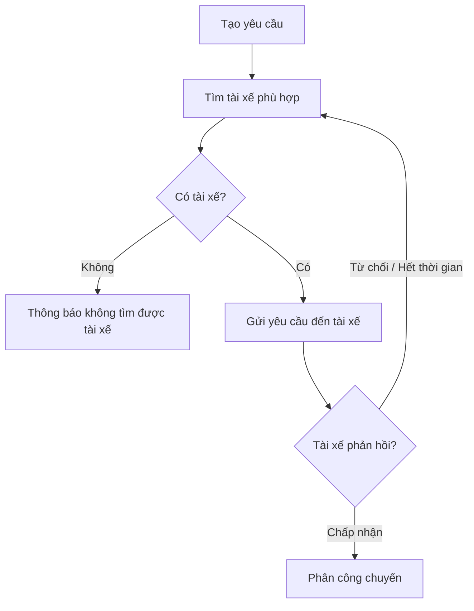
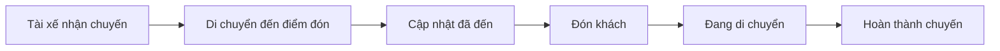
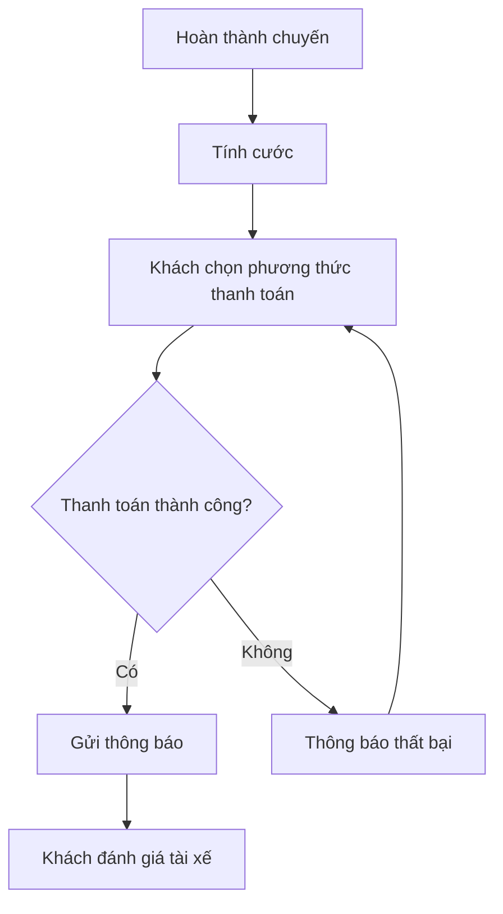
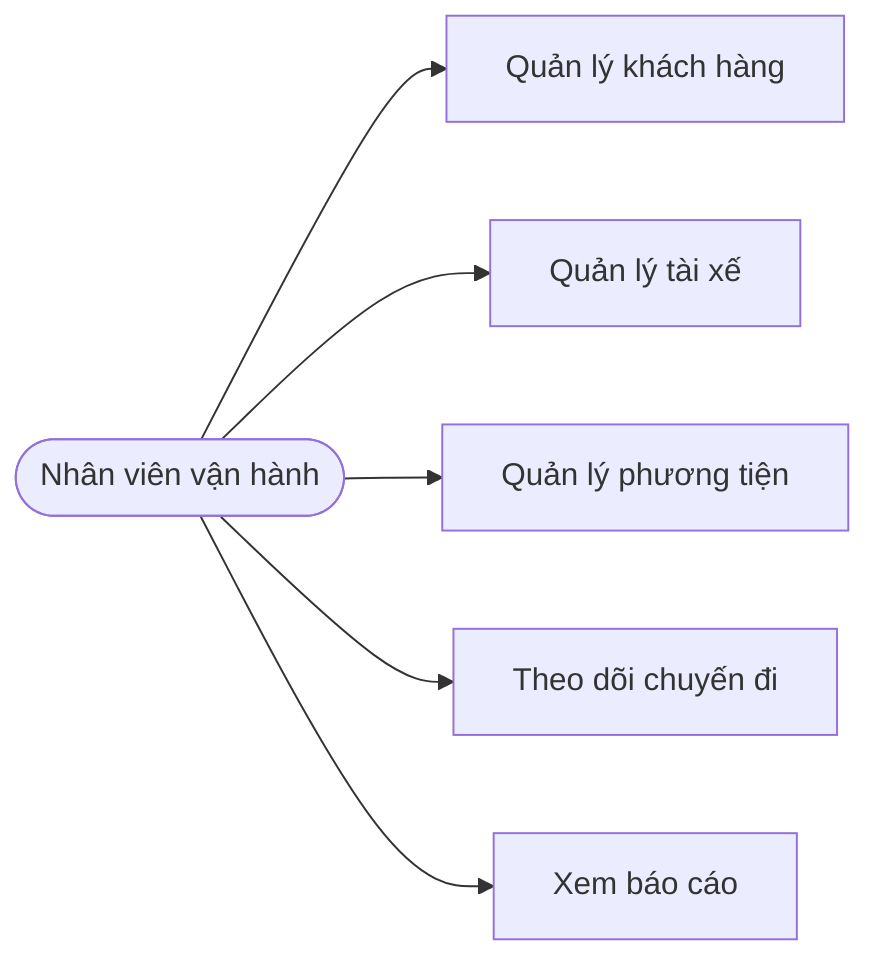
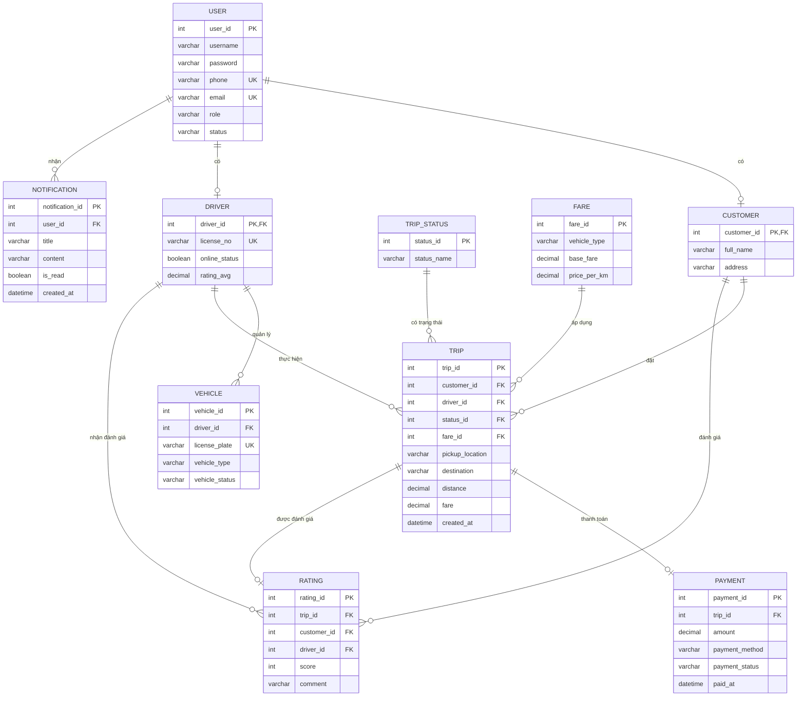

**Bước 1: Đọc và phân tích yêu cầu của khách hàng ở giai đoạn 1**
**1. Tổng quan yêu cầu**

# Tên dự án: CAB System – Nền tảng đặt xe trực tuyến
Thời gian triển khai: 7 tuần

*Bối cảnh hiện tại:*
Công ty ABC đang vận hành dịch vụ đặt xe qua tổng đài và một ứng dụng đơn giản. Hệ thống cũ tồn tại nhiều hạn chế:
- Phân công tài xế thực hiện thủ công.
- Khách hàng không theo dõi được trạng thái chuyến.
- Thanh toán chưa quản lý tập trung.
- Khó mở rộng khi số lượng người dùng tăng.

*Mục tiêu của khách hàng:*
- Xây dựng một nền tảng đặt xe có khả năng:
- Tự động tìm và phân công tài xế.
- Theo dõi chuyến đi theo thời gian thực.
- Hỗ trợ thanh toán an toàn.
- Quản trị tập trung.
- Dễ mở rộng thêm dịch vụ trong tương lai.

**Bước 2: Xác định Stakeholders và lập bảng Stakeholder Matrix**

| Stakeholder | Vai trò |
|---------|---------|
| Khách hàng | Đặt xe, thanh toán, hỗ trợ |
| Tài xế | Nhận và thực hiện chuyến |
| Nhân viên vận hành | Quản lý dữ liệu và hỗ trợ |
| Quản trị viên | Phân quyền, báo cáo |
| Cổng thanh toán | Xử lý thanh toán điện tử |
| Dịch vụ thông báo | Gửi Push/SMS/Email |

## Stakeholder Matrix

**Bước 3:  **
...

**Bước 4: Xác định phạm vi**

*Trong phạm vi:*
- Quản lý khách hàng, tài xế, phương tiện
- Đăng ký/đăng nhập
- Đặt xe và theo dõi chuyến
- Tự động tìm tài xế
- Quản lý trạng thái chuyến
- Tính cước
- Thanh toán tiền mặt & điện tử
- Đánh giá tài xế
- Quản trị và báo cáo

*Ngoài phạm vi:*
- Thuật toán AI tối ưu lộ trình
- Bản đồ riêng (sử dụng dịch vụ bản đồ bên ngoài)
- Ví điện tử nội bộ
- Chat giữa khách và tài xế
  
## Phạm vi dự án CAB System

**Bước 5: Chuyển yêu cầu thành các Bussiness Requirement thành BR**

## Business Requirements

| Mã BR | Tên BR | Yêu cầu nghiệp vụ |
|--------|---------|-------------------|
| BR-01 | Quản lý tài khoản khách hàng | Hệ thống phải cho phép khách hàng đăng ký, đăng nhập và cập nhật thông tin cá nhân. |
| BR-02 | Tạo yêu cầu đặt xe | Hệ thống phải cho phép khách hàng nhập điểm đón, điểm đến và lựa chọn loại xe để đặt xe. |
| BR-03 | Tự động phân công tài xế | Hệ thống phải tự động tìm và ưu tiên tài xế phù hợp dựa trên vị trí và trạng thái sẵn sàng. |
| BR-04 | Xử lý từ chối chuyến | Hệ thống phải tự động tìm tài xế khác khi tài xế được đề xuất từ chối hoặc không phản hồi. |
| BR-05 | Theo dõi chuyến đi | Hệ thống phải cho phép khách hàng theo dõi trạng thái chuyến đi và thời gian dự kiến tài xế đến. |
| BR-06 | Quản lý trạng thái chuyến | Hệ thống phải cho phép tài xế cập nhật các trạng thái: đã đến điểm đón, đã đón khách, đang di chuyển và hoàn thành chuyến. |
| BR-07 | Quản lý vị trí tài xế | Hệ thống phải lưu vị trí hiện tại của tài xế để hỗ trợ ghép chuyến và dự kiến thời gian đến. |
| BR-08 | Tính cước chuyến đi | Hệ thống phải tính số tiền phải trả sau khi chuyến đi hoàn thành dựa trên loại dịch vụ và thông tin chuyến đi. |
| BR-09 | Thanh toán | Hệ thống phải hỗ trợ thanh toán bằng tiền mặt và thanh toán điện tử thông qua cổng thanh toán bên ngoài. |
| BR-10 | Bảo mật thanh toán | Hệ thống không được lưu trữ thông tin nhạy cảm của thẻ hoặc tài khoản thanh toán. |
| BR-11 | Gửi thông báo | Hệ thống phải gửi thông báo cho khách hàng và tài xế tại các sự kiện quan trọng của chuyến đi. |
| BR-12 | Quản trị hệ thống | Hệ thống phải cung cấp giao diện để quản lý khách hàng, tài xế, phương tiện và chuyến đi. |
| BR-13 | Phân quyền người dùng | Hệ thống phải kiểm soát quyền truy cập đối với nhân viên vận hành và quản trị viên. |
| BR-14 | Báo cáo thống kê | Hệ thống phải cung cấp báo cáo về số chuyến, doanh thu, tỷ lệ hoàn thành và tỷ lệ hủy chuyến. |
| BR-15 | Khả năng mở rộng và ghi log | Hệ thống phải hoạt động ổn định, hỗ trợ mở rộng và lưu vết các thao tác quan trọng để phục vụ kiểm tra. |

**Bước 6: Xây dựng các Bussiness Process**

## BP-01 Quy trình đặt xe

## BP-02 Tìm và phân công tài xế

## BP-03 Thực hiện chuyến đi

## BP-04 Thanh toán và đánh giá

## BP-05 Quản trị vận hành

**Bước 7: Functional Requirements**

```mermaid
flowchart TB

    BR01["BR-01<br/>Quản lý tài khoản"]
    BR02["BR-02<br/>Quản lý khách hàng, tài xế, phương tiện"]
    BR03["BR-03<br/>Đặt xe và theo dõi chuyến"]
    BR04["BR-04<br/>Thanh toán và giao dịch"]
    BR05["BR-05<br/>Đánh giá và lịch sử chuyến"]
    BR06["BR-06<br/>Quản lý vận hành"]
    BR07["BR-07<br/>Quản trị hệ thống"]

    BR01 --> FR01["FR-01<br/>Đăng ký tài khoản"]
    BR01 --> FR02["FR-02<br/>Đăng nhập"]
    BR01 --> FR03["FR-03<br/>Quản lý thông tin cá nhân"]

    BR02 --> FR04["FR-04<br/>Quản lý khách hàng"]
    BR02 --> FR05["FR-05<br/>Quản lý tài xế"]
    BR02 --> FR06["FR-06<br/>Quản lý phương tiện"]

    BR03 --> FR07["FR-07<br/>Đặt xe"]
    BR03 --> FR08["FR-08<br/>Tính cước chuyến đi"]
    BR03 --> FR09["FR-09<br/>Tìm tài xế"]
    BR03 --> FR10["FR-10<br/>Xác nhận chuyến xe"]
    BR03 --> FR11["FR-11<br/>Theo dõi chuyến xe"]
    BR03 --> FR12["FR-12<br/>Cập nhật trạng thái chuyến"]
    BR03 --> FR13["FR-13<br/>Hủy chuyến xe"]

    BR04 --> FR14["FR-14<br/>Thanh toán"]
    BR04 --> FR15["FR-15<br/>Quản lý giao dịch"]

    BR05 --> FR16["FR-16<br/>Đánh giá tài xế"]
    BR05 --> FR17["FR-17<br/>Đánh giá khách hàng"]
    BR05 --> FR18["FR-18<br/>Xem lịch sử chuyến đi"]

    BR06 --> FR19["FR-19<br/>Thông báo"]
    BR06 --> FR20["FR-20<br/>Quản lý giá cước"]
    BR06 --> FR21["FR-21<br/>Quản lý trạng thái tài xế"]

    BR07 --> FR22["FR-22<br/>Quản lý chuyến xe"]
    BR07 --> FR23["FR-23<br/>Quản lý tài khoản"]
    BR07 --> FR24["FR-24<br/>Tra cứu chuyến xe"]
    BR07 --> FR25["FR-25<br/>Báo cáo thống kê"]
```

**Bước 8: Bussiness Rules và các trường hợp ngoại lệ**

*Bussiness Rules*
|  Mã  | Quy tắc nghiệp vụ |
|:----:|-------------------|
| BR01 | Phải đăng nhập mới được đặt xe |
| BR02 | Chỉ tài xế Online mới được nhận chuyến |
| BR03 | Một tài xế chỉ được nhận một chuyến tại một thời điểm |
| BR04 | Chuyến xe phải hoàn thành mới được thanh toán |
| BR05 | Chỉ khách hàng đã hoàn thành chuyến mới được đánh giá |
| BR06 | Không lưu thông tin thẻ thanh toán trong hệ thống CAB |

*Trường hợp ngoại lệ*

| Tình huống | Xử lý |
|---|---|
| Không có tài xế | Thông báo cho khách hàng không tìm thấy tài xế phù hợp |
| Tài xế từ chối | Hệ thống tìm tài xế tiếp theo |
| Tài xế không phản hồi | Hết thời gian chờ (Timeout), hệ thống tìm lại tài xế khác |
| Thanh toán lỗi | Thông báo lỗi và cho phép khách hàng thực hiện thanh toán lại |
| Mất kết nối | Lưu dữ liệu tạm thời và đồng bộ lại khi có mạng |

**Bước 9: Data Modeling**

### Data Modeling

#### Danh sách Entity

| Mã | Entity | Mô tả |
|---|---|---|
| E01 | USER | Quản lý thông tin tài khoản người dùng |
| E02 | CUSTOMER | Thông tin khách hàng |
| E03 | DRIVER | Thông tin tài xế |
| E04 | VEHICLE | Thông tin phương tiện |
| E05 | TRIP | Thông tin chuyến xe |
| E06 | TRIP_STATUS | Trạng thái của chuyến xe |
| E07 | PAYMENT | Thông tin thanh toán |
| E08 | RATING | Đánh giá sau chuyến xe |
| E09 | FARE | Bảng giá cước |
| E10 | NOTIFICATION | Thông báo cho người dùng |

#### Quan hệ giữa các Entity

| Entity 1 | Quan hệ | Entity 2 | Mô tả |
|---|---|---|---|
| USER | 1 - 1 | CUSTOMER | Một tài khoản có thể thuộc về một khách hàng |
| USER | 1 - 1 | DRIVER | Một tài khoản có thể thuộc về một tài xế |
| DRIVER | 1 - N | VEHICLE | Một tài xế có thể quản lý nhiều phương tiện |
| CUSTOMER | 1 - N | TRIP | Một khách hàng có thể đặt nhiều chuyến xe |
| DRIVER | 1 - N | TRIP | Một tài xế có thể thực hiện nhiều chuyến xe |
| TRIP_STATUS | 1 - N | TRIP | Một trạng thái có thể được sử dụng cho nhiều chuyến xe |
| TRIP | 1 - 1 | PAYMENT | Một chuyến xe có một giao dịch thanh toán |
| TRIP | 1 - 1 | RATING | Một chuyến xe có thể có một đánh giá |
| CUSTOMER | 1 - N | RATING | Một khách hàng có thể thực hiện nhiều đánh giá |
| DRIVER | 1 - N | RATING | Một tài xế có thể nhận nhiều đánh giá |
| FARE | 1 - N | TRIP | Một bảng giá có thể áp dụng cho nhiều chuyến xe |
| USER | 1 - N | NOTIFICATION | Một người dùng có thể nhận nhiều thông báo |

#### ERD

**Bước 10: Xác định Non_Functional Requirements**

### Non-Functional Requirements

| Mã | Nhóm | Non-Functional Requirement |
|---|---|---|
| NFR01 | Hiệu năng | Hệ thống phải phản hồi các thao tác thông thường của người dùng trong thời gian không quá 3 giây. |
| NFR02 | Hiệu năng | Hệ thống phải cập nhật vị trí và trạng thái chuyến xe gần như theo thời gian thực. |
| NFR03 | Khả năng mở rộng | Hệ thống phải có khả năng đáp ứng số lượng lớn khách hàng, tài xế và chuyến xe đồng thời. |
| NFR04 | Bảo mật | Mật khẩu người dùng phải được mã hóa trước khi lưu vào hệ thống. |
| NFR05 | Bảo mật | Hệ thống không được lưu trữ thông tin thẻ thanh toán của khách hàng. |
| NFR06 | Bảo mật | Chỉ người dùng có quyền phù hợp mới được truy cập các chức năng tương ứng. |
| NFR07 | Bảo mật | Hệ thống phải tự động hết hạn phiên đăng nhập sau một khoảng thời gian không hoạt động. |
| NFR08 | Tính sẵn sàng | Hệ thống phải hoạt động ổn định và hạn chế tối đa thời gian gián đoạn dịch vụ. |
| NFR09 | Tin cậy | Dữ liệu chuyến xe, thanh toán và tài khoản phải được lưu trữ chính xác, tránh mất mát hoặc trùng lặp. |
| NFR10 | Khả năng phục hồi | Hệ thống phải có cơ chế sao lưu và khôi phục dữ liệu khi xảy ra sự cố. |
| NFR11 | Khả năng sử dụng | Giao diện phải đơn giản, dễ hiểu và dễ sử dụng đối với khách hàng, tài xế và quản trị viên. |
| NFR12 | Tương thích | Hệ thống phải hoạt động trên các trình duyệt phổ biến và thiết bị di động. |
| NFR13 | Bảo trì | Hệ thống phải được thiết kế theo các module để dễ dàng bảo trì và nâng cấp. |
| NFR14 | Toàn vẹn dữ liệu | Hệ thống phải đảm bảo dữ liệu giữa khách hàng, tài xế, chuyến xe và thanh toán luôn nhất quán. |
| NFR15 | Khả năng kiểm tra | Hệ thống phải ghi nhận log các hoạt động quan trọng như đăng nhập, đặt xe, hủy chuyến và thanh toán. |

**Bước 11: Thiết kế use case diagram**

| Mã | Tên Use Case | Actor chính |
|---|---|---|
| UC01 | Đăng ký / Đăng nhập | Khách hàng, Tài xế, Quản trị viên |
| UC02 | Đặt xe | Khách hàng |
| UC03 | Quản lý chuyến xe | Khách hàng, Tài xế |
| UC04 | Thanh toán chuyến xe | Khách hàng |
| UC05 | Đánh giá chuyến xe | Khách hàng, Tài xế |
| UC06 | Quản lý thông tin | Khách hàng, Tài xế |
| UC07 | Quản lý hệ thống | Quản trị viên |
| UC08 | Xem báo cáo thống kê | Quản trị viên |

**Bước 12: Đặc tả use case**

### UC01 – Đăng ký / Đăng nhập

| Thành phần | Nội dung |
|---|---|
| Mã Use Case | UC01 |
| Tên Use Case | Đăng ký / Đăng nhập |
| Actor | Khách hàng, Tài xế, Quản trị viên |
| Mục tiêu | Cho phép người dùng tạo tài khoản và truy cập hệ thống |
| Tiền điều kiện | Người dùng chưa đăng nhập |
| Hậu điều kiện | Người dùng đăng nhập thành công và được cấp quyền phù hợp |
| Luồng chính | 1. Người dùng chọn Đăng ký hoặc Đăng nhập. 2. Nhập thông tin tài khoản. 3. Hệ thống kiểm tra thông tin. 4. Hệ thống xác thực tài khoản. 5. Đăng nhập thành công và chuyển đến giao diện tương ứng. |
| Ngoại lệ | Tài khoản đã tồn tại → Thông báo lỗi. Sai tài khoản/mật khẩu → Yêu cầu nhập lại. Tài khoản bị khóa → Từ chối đăng nhập. |
| Business Rules | BR01 |

### UC02 – Đặt xe

| Thành phần | Nội dung |
|---|---|
| Mã Use Case | UC02 |
| Tên Use Case | Đặt xe |
| Actor | Khách hàng |
| Mục tiêu | Cho phép khách hàng yêu cầu một chuyến xe |
| Tiền điều kiện | Khách hàng đã đăng nhập và hệ thống đang hoạt động |
| Hậu điều kiện | Yêu cầu đặt xe được tạo và hệ thống bắt đầu tìm tài xế |
| Luồng chính | 1. Khách hàng nhập điểm đón và điểm đến. 2. Hệ thống xác định vị trí. 3. Hệ thống tính giá cước dự kiến. 4. Khách hàng xác nhận đặt xe. 5. Hệ thống tìm tài xế Online phù hợp. 6. Hệ thống gửi yêu cầu cho tài xế. 7. Tài xế nhận chuyến. 8. Hệ thống thông báo thông tin tài xế cho khách hàng. |
| Ngoại lệ | Không có tài xế → Thông báo khách hàng. Tài xế từ chối → Tìm tài xế tiếp theo. Tài xế không phản hồi → Timeout và tìm lại. Không xác định được vị trí → Yêu cầu nhập lại. Mất kết nối → Đồng bộ lại khi có mạng. |
| Business Rules | BR01, BR02, BR03 |

### UC03 – Quản lý chuyến xe

| Thành phần | Nội dung |
|---|---|
| Mã Use Case | UC03 |
| Tên Use Case | Quản lý chuyến xe |
| Actor | Khách hàng, Tài xế |
| Mục tiêu | Cho phép thực hiện, theo dõi và cập nhật trạng thái chuyến xe |
| Tiền điều kiện | Chuyến xe đã được tạo và tài xế đã nhận chuyến |
| Hậu điều kiện | Chuyến xe được hoàn thành hoặc hủy |
| Luồng chính | 1. Tài xế nhận chuyến. 2. Tài xế cập nhật trạng thái đang đến đón. 3. Khách hàng theo dõi chuyến xe. 4. Tài xế đón khách. 5. Tài xế cập nhật trạng thái đang di chuyển. 6. Tài xế đến điểm đến. 7. Tài xế cập nhật chuyến hoàn thành. 8. Hệ thống lưu lịch sử chuyến. |
| Ngoại lệ | Tài xế hủy → Tìm tài xế khác. Khách hàng hủy → Cập nhật chuyến đã hủy. Mất kết nối → Đồng bộ trạng thái khi có mạng. |
| Business Rules | BR02, BR03 |

### UC04 – Thanh toán chuyến xe

| Thành phần | Nội dung |
|---|---|
| Mã Use Case | UC04 |
| Tên Use Case | Thanh toán chuyến xe |
| Actor | Khách hàng |
| Mục tiêu | Cho phép khách hàng thanh toán chi phí chuyến xe |
| Tiền điều kiện | Chuyến xe đã hoàn thành |
| Hậu điều kiện | Giao dịch được ghi nhận thành công |
| Luồng chính | 1. Hệ thống xác định số tiền cần thanh toán. 2. Khách hàng chọn phương thức thanh toán. 3. Khách hàng xác nhận thanh toán. 4. Hệ thống gửi yêu cầu thanh toán. 5. Hệ thống nhận kết quả. 6. Hệ thống cập nhật trạng thái thanh toán. |
| Ngoại lệ | Thanh toán lỗi → Thông báo và cho phép thanh toán lại. Mất kết nối → Kiểm tra lại trạng thái giao dịch khi có mạng. Giao dịch không hợp lệ → Từ chối giao dịch. |
| Business Rules | BR04, BR06 |

### UC05 – Đánh giá chuyến xe

| Thành phần | Nội dung |
|---|---|
| Mã Use Case | UC05 |
| Tên Use Case | Đánh giá chuyến xe |
| Actor | Khách hàng, Tài xế |
| Mục tiêu | Cho phép khách hàng và tài xế đánh giá sau khi hoàn thành chuyến |
| Tiền điều kiện | Chuyến xe đã hoàn thành |
| Hậu điều kiện | Đánh giá được lưu vào hệ thống |
| Luồng chính | 1. Người dùng mở lịch sử chuyến. 2. Chọn chuyến đã hoàn thành. 3. Nhập số điểm đánh giá và nhận xét. 4. Hệ thống kiểm tra điều kiện đánh giá. 5. Hệ thống lưu đánh giá. 6. Cập nhật điểm đánh giá của đối tượng được đánh giá. |
| Ngoại lệ | Chuyến chưa hoàn thành → Không cho phép đánh giá. Đã đánh giá → Không cho phép đánh giá lại. |
| Business Rules | BR05 |

### UC06 – Quản lý thông tin

| Thành phần | Nội dung |
|---|---|
| Mã Use Case | UC06 |
| Tên Use Case | Quản lý thông tin |
| Actor | Khách hàng, Tài xế |
| Mục tiêu | Cho phép người dùng xem và cập nhật thông tin cá nhân |
| Tiền điều kiện | Người dùng đã đăng nhập |
| Hậu điều kiện | Thông tin mới được cập nhật thành công |
| Luồng chính | 1. Người dùng mở trang thông tin cá nhân. 2. Hệ thống hiển thị thông tin hiện tại. 3. Người dùng chỉnh sửa thông tin. 4. Hệ thống kiểm tra dữ liệu. 5. Người dùng xác nhận. 6. Hệ thống lưu thông tin mới. |
| Ngoại lệ | Dữ liệu không hợp lệ → Thông báo lỗi và yêu cầu nhập lại. Email/số điện thoại đã tồn tại → Không cho phép cập nhật. |
| Business Rules | BR01 |

### UC07 – Quản lý hệ thống

| Thành phần | Nội dung |
|---|---|
| Mã Use Case | UC07 |
| Tên Use Case | Quản lý hệ thống |
| Actor | Quản trị viên |
| Mục tiêu | Cho phép quản trị viên quản lý dữ liệu và hoạt động của hệ thống |
| Tiền điều kiện | Quản trị viên đã đăng nhập và có quyền quản trị |
| Hậu điều kiện | Thông tin quản lý được cập nhật thành công |
| Luồng chính | 1. Quản trị viên đăng nhập. 2. Chọn chức năng quản lý. 3. Hệ thống hiển thị dữ liệu. 4. Quản trị viên thêm, sửa, xóa hoặc cập nhật dữ liệu. 5. Hệ thống kiểm tra dữ liệu. 6. Hệ thống lưu thay đổi. |
| Ngoại lệ | Không có quyền → Từ chối truy cập. Dữ liệu không hợp lệ → Thông báo lỗi. Dữ liệu đang được sử dụng → Không cho phép xóa. |
| Business Rules | BR06 |

### UC08 – Xem báo cáo thống kê

| Thành phần | Nội dung |
|---|---|
| Mã Use Case | UC08 |
| Tên Use Case | Xem báo cáo thống kê |
| Actor | Quản trị viên |
| Mục tiêu | Cho phép quản trị viên theo dõi tình hình hoạt động của hệ thống |
| Tiền điều kiện | Quản trị viên đã đăng nhập |
| Hậu điều kiện | Báo cáo được hiển thị theo yêu cầu |
| Luồng chính | 1. Quản trị viên chọn chức năng báo cáo. 2. Chọn loại báo cáo và khoảng thời gian. 3. Hệ thống truy xuất dữ liệu. 4. Hệ thống tổng hợp dữ liệu. 5. Hệ thống hiển thị báo cáo. |
| Ngoại lệ | Không có dữ liệu → Thông báo không có dữ liệu phù hợp. Lỗi truy xuất dữ liệu → Thông báo lỗi và cho phép thực hiện lại. |
| Business Rules | BR06 |

**Bước 13: Những tiêu chí chấp nhận

| Mã | Use Case | Tiêu chí chấp nhận |
|---|---|---|
| AC01 | UC01 - Đăng ký / Đăng nhập | Người dùng đăng ký thành công khi thông tin hợp lệ và đăng nhập được bằng tài khoản đã đăng ký. |
| AC02 | UC01 - Đăng ký / Đăng nhập | Hệ thống phải từ chối đăng nhập khi sai tài khoản, mật khẩu hoặc tài khoản bị khóa. |
| AC03 | UC02 - Đặt xe | Khách hàng đã đăng nhập có thể nhập điểm đón, điểm đến và gửi yêu cầu đặt xe. |
| AC04 | UC02 - Đặt xe | Hệ thống phải tính và hiển thị giá cước dự kiến trước khi khách hàng xác nhận đặt xe. |
| AC05 | UC02 - Đặt xe | Hệ thống chỉ tìm và gửi yêu cầu đến các tài xế đang Online. |
| AC06 | UC02 - Đặt xe | Nếu tài xế từ chối hoặc không phản hồi, hệ thống phải tự động tìm tài xế tiếp theo. |
| AC07 | UC03 - Quản lý chuyến xe | Tài xế có thể nhận chuyến và cập nhật trạng thái chuyến theo đúng trình tự. |
| AC08 | UC03 - Quản lý chuyến xe | Khách hàng có thể theo dõi trạng thái chuyến xe sau khi tài xế nhận chuyến. |
| AC09 | UC03 - Quản lý chuyến xe | Một tài xế không được nhận nhiều chuyến đang hoạt động cùng một thời điểm. |
| AC10 | UC03 - Quản lý chuyến xe | Khi chuyến hoàn thành, hệ thống phải lưu thông tin chuyến vào lịch sử. |
| AC11 | UC04 - Thanh toán chuyến xe | Khách hàng chỉ được thanh toán khi chuyến xe đã hoàn thành. |
| AC12 | UC04 - Thanh toán chuyến xe | Khi thanh toán thành công, hệ thống phải cập nhật trạng thái giao dịch thành công. |
| AC13 | UC04 - Thanh toán chuyến xe | Khi thanh toán thất bại, hệ thống phải thông báo lỗi và cho phép thanh toán lại. |
| AC14 | UC04 - Thanh toán chuyến xe | Hệ thống không được lưu thông tin thẻ thanh toán của khách hàng. |
| AC15 | UC05 - Đánh giá chuyến xe | Chỉ khách hàng hoặc tài xế đã hoàn thành chuyến mới được đánh giá. |
| AC16 | UC05 - Đánh giá chuyến xe | Hệ thống phải lưu điểm đánh giá và nội dung nhận xét sau khi đánh giá thành công. |
| AC17 | UC06 - Quản lý thông tin | Người dùng đã đăng nhập có thể xem và cập nhật thông tin cá nhân. |
| AC18 | UC06 - Quản lý thông tin | Hệ thống phải kiểm tra dữ liệu trước khi lưu thông tin cập nhật. |
| AC19 | UC07 - Quản lý hệ thống | Chỉ quản trị viên có quyền quản lý khách hàng, tài xế, phương tiện và chuyến xe. |
| AC20 | UC07 - Quản lý hệ thống | Quản trị viên có thể thêm, sửa, xóa hoặc cập nhật trạng thái dữ liệu hợp lệ. |
| AC21 | UC08 - Xem báo cáo thống kê | Quản trị viên có thể xem báo cáo theo loại báo cáo và khoảng thời gian. |
| AC22 | UC08 - Xem báo cáo thống kê | Hệ thống phải thông báo khi không có dữ liệu phù hợp với điều kiện tìm kiếm. |

**Bước 14: Truy xuất yêu cầu (Requirements Traceability)**

### Truy xuất yêu cầu

| Mã BR | Mã FR | Use Case | Tiêu chí chấp nhận |
|---|---|---|---|
| BR01 | FR01 - Đăng ký tài khoản | UC01 - Đăng ký / Đăng nhập | AC01, AC02 |
| BR01 | FR02 - Đăng nhập | UC01 - Đăng ký / Đăng nhập | AC01, AC02 |
| BR01 | FR03 - Quản lý thông tin cá nhân | UC06 - Quản lý thông tin | AC17, AC18 |
| BR02 | FR04 - Quản lý khách hàng | UC07 - Quản lý hệ thống | AC19, AC20 |
| BR02 | FR05 - Quản lý tài xế | UC07 - Quản lý hệ thống | AC19, AC20 |
| BR02 | FR06 - Quản lý phương tiện | UC07 - Quản lý hệ thống | AC19, AC20 |
| BR03 | FR07 - Đặt xe | UC02 - Đặt xe | AC03, AC04, AC05, AC06 |
| BR03 | FR08 - Tính cước chuyến đi | UC02 - Đặt xe | AC04 |
| BR03 | FR09 - Tìm tài xế | UC02 - Đặt xe | AC05, AC06 |
| BR03 | FR10 - Xác nhận chuyến | UC03 - Quản lý chuyến xe | AC07, AC09 |
| BR03 | FR11 - Theo dõi chuyến xe | UC03 - Quản lý chuyến xe | AC08 |
| BR03 | FR12 - Cập nhật trạng thái chuyến | UC03 - Quản lý chuyến xe | AC07, AC10 |
| BR03 | FR13 - Hủy chuyến | UC03 - Quản lý chuyến xe | AC07 |
| BR04 | FR14 - Thanh toán | UC04 - Thanh toán chuyến xe | AC11, AC12, AC13, AC14 |
| BR04 | FR15 - Quản lý giao dịch | UC04 - Thanh toán chuyến xe | AC12, AC13 |
| BR05 | FR16 - Đánh giá tài xế | UC05 - Đánh giá chuyến xe | AC15, AC16 |
| BR05 | FR17 - Đánh giá khách hàng | UC05 - Đánh giá chuyến xe | AC15, AC16 |
| BR05 | FR18 - Xem lịch sử chuyến | UC03 - Quản lý chuyến xe | AC10 |
| BR06 | FR19 - Thông báo | UC02, UC03 | AC06, AC08 |
| BR06 | FR20 - Quản lý giá cước | UC07 - Quản lý hệ thống | AC20 |
| BR06 | FR21 - Quản lý trạng thái tài xế | UC03 - Quản lý chuyến xe | AC07, AC09 |
| BR07 | FR22 - Quản lý chuyến xe | UC07 - Quản lý hệ thống | AC19, AC20 |
| BR07 | FR23 - Quản lý tài khoản | UC07 - Quản lý hệ thống | AC19, AC20 |
| BR07 | FR24 - Tra cứu chuyến xe | UC07 - Quản lý hệ thống | AC20 |
| BR07 | FR25 - Báo cáo thống kê | UC08 - Xem báo cáo thống kê | AC21, AC22 |

### Requirements Traceability Matrix

| PG | BR | FR | UC | AC |
|---|---|---|---|---|
| PG01 | BR01 | FR01 - Đăng ký tài khoản | UC01 - Đăng ký / Đăng nhập | AC01, AC02 |
| PG01 | BR01 | FR02 - Đăng nhập | UC01 - Đăng ký / Đăng nhập | AC01, AC02 |
| PG01 | BR01 | FR03 - Quản lý thông tin cá nhân | UC06 - Quản lý thông tin | AC17, AC18 |
| PG01 | BR02 | FR04 - Quản lý khách hàng | UC07 - Quản lý hệ thống | AC19, AC20 |
| PG01 | BR02 | FR05 - Quản lý tài xế | UC07 - Quản lý hệ thống | AC19, AC20 |
| PG01 | BR02 | FR06 - Quản lý phương tiện | UC07 - Quản lý hệ thống | AC19, AC20 |
| PG02 | BR03 | FR07 - Đặt xe | UC02 - Đặt xe | AC03, AC04, AC05, AC06 |
| PG02 | BR03 | FR08 - Tính cước chuyến đi | UC02 - Đặt xe | AC04 |
| PG02 | BR03 | FR09 - Tìm tài xế | UC02 - Đặt xe | AC05, AC06 |
| PG02 | BR03 | FR10 - Xác nhận chuyến | UC03 - Quản lý chuyến xe | AC07, AC09 |
| PG02 | BR03 | FR11 - Theo dõi chuyến xe | UC03 - Quản lý chuyến xe | AC08 |
| PG02 | BR03 | FR12 - Cập nhật trạng thái chuyến | UC03 - Quản lý chuyến xe | AC07, AC10 |
| PG02 | BR03 | FR13 - Hủy chuyến | UC03 - Quản lý chuyến xe | AC07 |
| PG03 | BR04 | FR14 - Thanh toán | UC04 - Thanh toán chuyến xe | AC11, AC12, AC13, AC14 |
| PG03 | BR04 | FR15 - Quản lý giao dịch | UC04 - Thanh toán chuyến xe | AC12, AC13 |
| PG04 | BR05 | FR16 - Đánh giá tài xế | UC05 - Đánh giá chuyến xe | AC15, AC16 |
| PG04 | BR05 | FR17 - Đánh giá khách hàng | UC05 - Đánh giá chuyến xe | AC15, AC16 |
| PG04 | BR05 | FR18 - Xem lịch sử chuyến | UC03 - Quản lý chuyến xe | AC10 |
| PG05 | BR06 | FR19 - Thông báo | UC02, UC03 | AC06, AC08 |
| PG05 | BR06 | FR20 - Quản lý giá cước | UC07 - Quản lý hệ thống | AC20 |
| PG05 | BR06 | FR21 - Quản lý trạng thái tài xế | UC03 - Quản lý chuyến xe | AC07, AC09 |
| PG06 | BR07 | FR22 - Quản lý chuyến xe | UC07 - Quản lý hệ thống | AC19, AC20 |
| PG06 | BR07 | FR23 - Quản lý tài khoản | UC07 - Quản lý hệ thống | AC19, AC20 |
| PG06 | BR07 | FR24 - Tra cứu chuyến xe | UC07 - Quản lý hệ thống | AC20 |
| PG06 | BR07 | FR25 - Báo cáo thống kê | UC08 - Xem báo cáo thống kê | AC21, AC22 |

